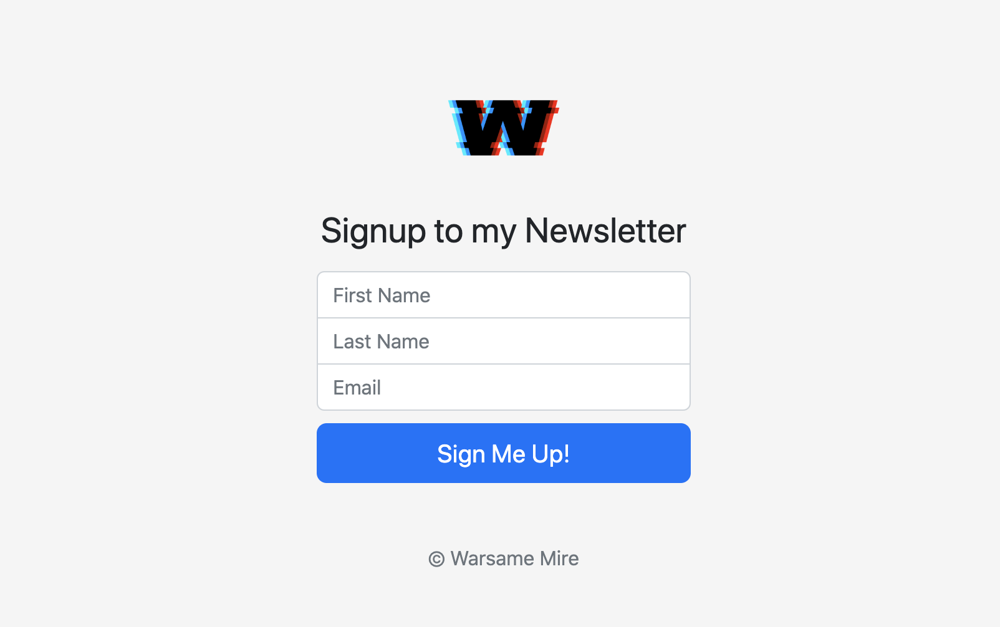

## Newsletter Signup

This is a newsletter signup page that posts data to the Mail Chimp server via API

## Project Screen Shot(s)

## Installation and Setup Instructions

Clone down this repository. You will need `node` and `npm` installed globally on your machine.  

Installation:

`npm install`

To Start Server:

`node app.js`
 
To Visit App:

`localhost:3000/ideas`  

## Reflection

This project was created after reading and learning mail chimps api documentations, I wanted to create a projet where I can pass user data to a another server.

I set out to create a website where a user can type in their full name and email which would be used to subscribe to a newsletter, once subscribed I can send many emails and alert to the users using the mail chimp services.

The tools I used to build the project are HTML, CSS, Bootstrap, Javascript, Node.js and Express.js.
